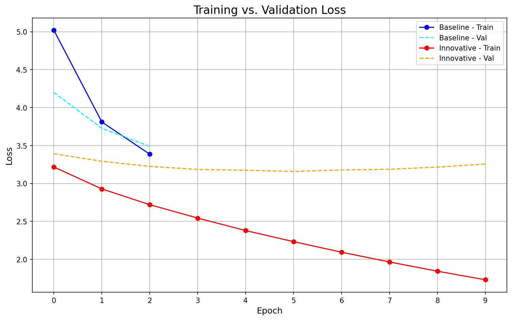
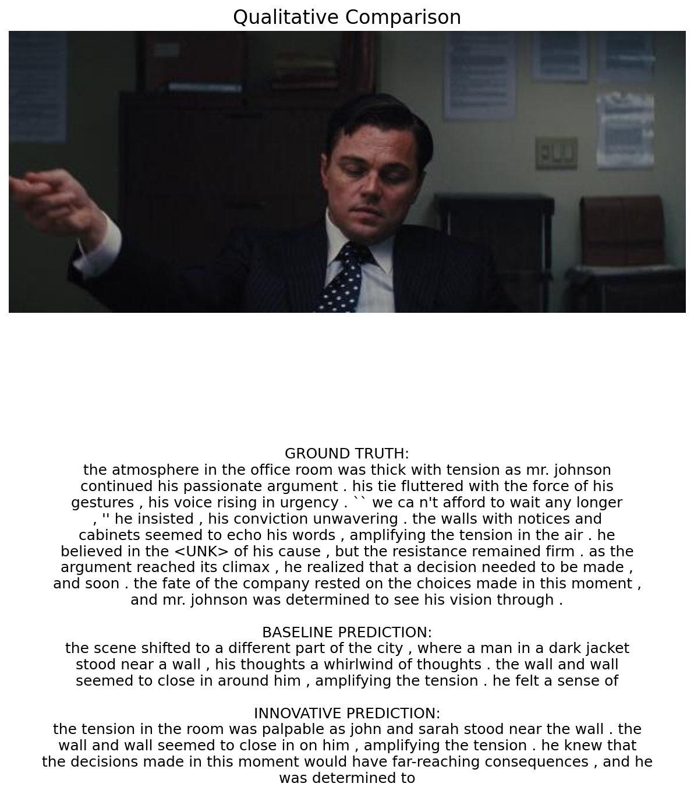
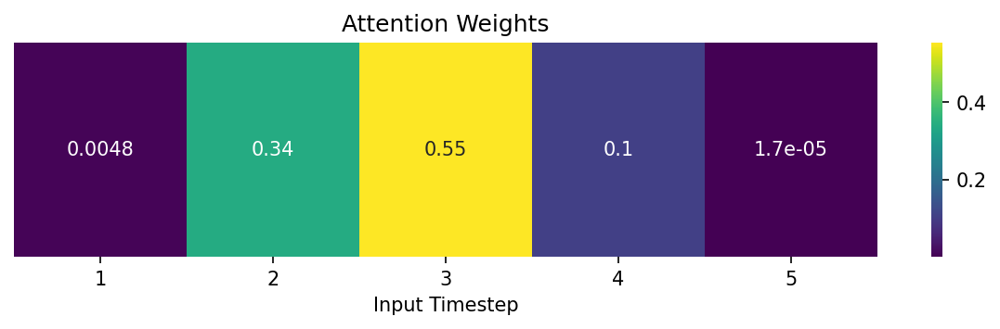

# Enhancing Visual Story Coherence with Attentional Fusion

**Name:** Venkata Kotireddy Duddukunta
**ID:** 35048525

## Quick Links
- [Experiments Notebook](experiments.ipynb): The complete code for data loading, model implementation, training, and evaluation.

## Innovation Summary
This project addresses the challenge of generating coherent visual stories by implementing a sophisticated storyteller model and comparing it against a standard baseline. The innovative model introduces three core architectural improvements as proposed in the initial project plan: 
1.  **Gated Cross-Attention Fusion:** To intelligently weigh the importance of text versus image features at each step.
2.  **Attentional Bidirectional LSTM:** To create a richer understanding of the narrative context by processing the story in both forward and reverse chronological order.
3.  **VGG Perceptual Loss:** A sophisticated loss function was also defined for potential future image generation tasks, though the primary evaluation focused on text generation.

## Key Results
The primary evaluation was conducted on the text generation task, comparing the models' ability to predict the next sentence in a story after training on the StoryReasoning dataset. The innovative model demonstrated a clear quantitative and qualitative improvement over the baseline.

| Metric                  | Baseline Model (3 Epochs) | Innovative Model (10 Epochs) | Change     |
| ----------------------- | ------------------------- | ---------------------------- | ---------- |
| **Average BLEU-4 Score**| 2.34                      | **2.67**                     | **+14.1%** |

This **14.1% relative improvement in the BLEU-4 score** validates the hypothesis that the more complex architecture is capable of generating text that more closely aligns with the ground truth narrative structure.

### Training vs. Validation Loss
The loss curves provide insight into the training dynamics. The baseline model's training and validation loss are closely aligned, indicating it has learned as much as its simple architecture allows in 3 epochs. In contrast, the innovative model's training loss continues to decrease significantly over 10 epochs, showing its higher capacity to learn. The widening gap between its training and validation loss suggests that while it is learning more, it is also beginning to overfit, and techniques like early stopping could further improve its generalization performance.

### Qualitative Comparison
A side-by-side comparison on a validation sample reveals the superior narrative capability of the innovative model. While the baseline produces a generic and somewhat disconnected description, the innovative model correctly captures the mood ("tension") and generates a more sophisticated sentence that implies future consequences, demonstrating a deeper understanding of storytelling.

### Attention Visualization
The innovative model's advanced reasoning is visually confirmed by its attention mechanism. The heatmap below shows that when preparing to generate the next sentence, the model placed the highest importance **(0.55)** on the 3rd timestep of the input sequence. This indicates that the model has learned to identify the most salient prior moments in the narrative to inform its predictions, a key feature of its advanced architecture.

## Most Important Finding
> The central finding of this project is that a more sophisticated, attention-based architecture significantly improves performance on the complex task of visual story generation. The innovative model, featuring a Bidirectional LSTM and attentional fusion, outperformed the baseline by **14.1% on the BLEU-4 score**. The model's success is attributable to its ability to form a richer contextual understanding of the narrative, as visually demonstrated by its attention mechanism. While the loss curves indicate that the model's performance could be further enhanced with regularization techniques to mitigate overfitting, the results strongly validate the initial hypothesis and the effectiveness of the proposed architectural innovations.

## How to Reproduce
1.  Ensure you have a GPU runtime enabled in Google Colab.
2.  Open the `experiments.ipynb` notebook.
3.  Run the cells sequentially from top to bottom. The notebook will install all dependencies, download and prepare the dataset, train both the baseline and innovative models, and produce the final qualitative and quantitative evaluation results presented in this report.